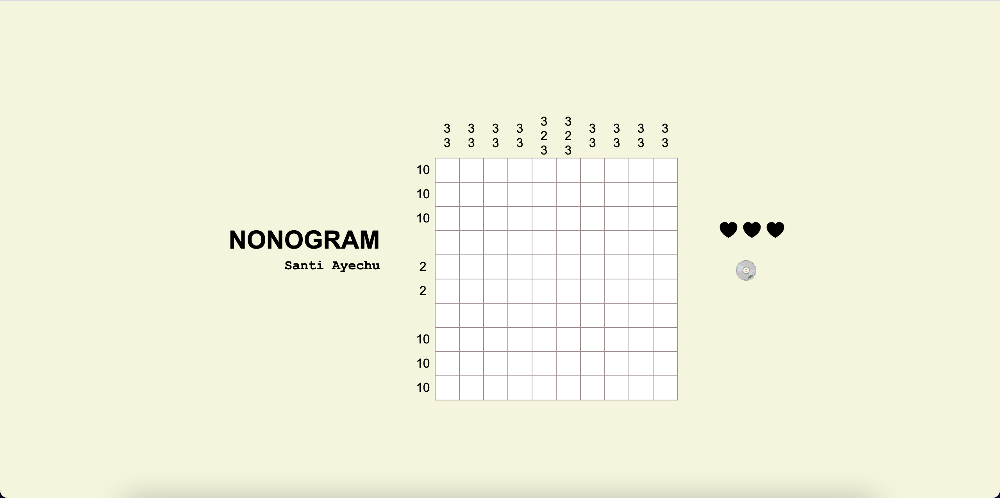

### Nonogram
##### Santi Ayechu

---

Nonogram challenges players to unveil a hidden image by filling cells in a grid. In this variant, themed around compact discs (CDs), each row and column in the grid is labeled with a sequence of numbers. These numbers indicate how many consecutive cells should be filled in that row or column, while leaving at least one space between each consecutive group. To place a space in the grid, select the appropriate selector by clicking on the CD or cross icon on the right side (below the life images).
\*[CD]: Compact Disc

